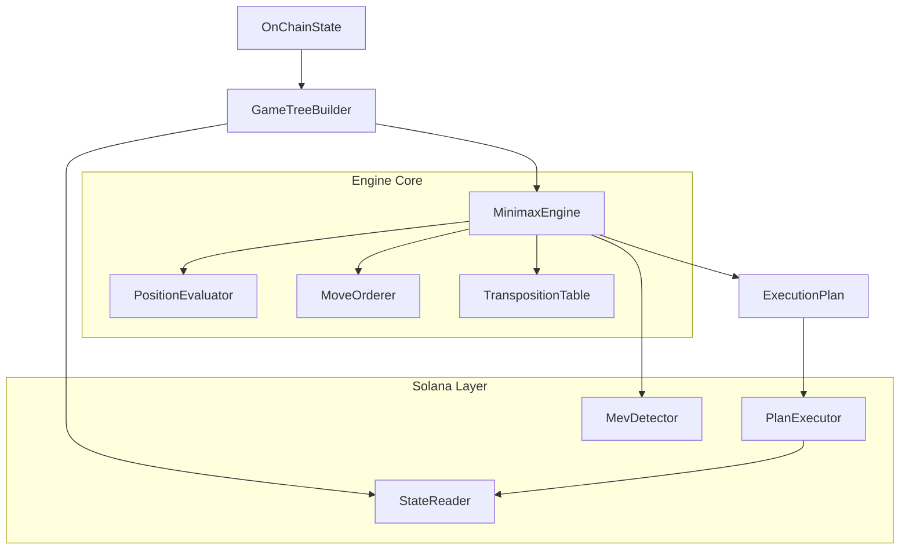

# MNMX Core

[](https://github.com/mnmx-protocol/mnmx-core/actions)
[](./LICENSE)
[](https://www.typescriptlang.org/)
[](https://solana.com/)
[](https://www.npmjs.com/package/@mnmx/core)

---

**Minimax execution engine for autonomous on-chain agents.**

MNMX applies adversarial game-tree search to on-chain execution. The core insight is that DeFi transactions operate in an adversarial environment -- MEV bots watch the mempool and act against you. This is structurally identical to a two-player zero-sum game: your agent is the maximizer, MEV bots are the minimizers.

The same minimax algorithm that powers chess engines can determine the optimal sequence of on-chain actions when the opponent is a rational, profit-seeking adversary. MNMX implements this with alpha-beta pruning, iterative deepening, transposition tables, and move ordering heuristics -- the same toolkit that took game engines from brute force to superhuman play.

The result: execution plans that are provably optimal against rational adversaries, not just heuristically "good enough."

## Architecture



**Data flow:**

1. **StateReader** fetches token balances, pool reserves, and pending transactions from Solana RPC.
2. **GameTreeBuilder** constructs the game tree by simulating agent actions and adversary responses.
3. **MinimaxEngine** searches the tree with alpha-beta pruning, using iterative deepening to search depth 1, 2, 3, ... until the time budget expires.
4. **PositionEvaluator** scores leaf nodes across four dimensions: gas cost, slippage impact, MEV exposure, and profit potential.
5. **MevDetector** identifies sandwich, frontrun, backrun, and JIT liquidity threats.
6. **PlanExecutor** converts the optimal action sequence into Solana transactions and submits them.

## Quick Start

```bash
git clone https://github.com/mnmx-protocol/mnmx-core.git
cd mnmx-core
npm ci
npm run build
npm test
```

## Usage

```typescript
import { MinimaxEngine } from '@mnmx/core';
import type { OnChainState, ExecutionAction } from '@mnmx/core';

const engine = new MinimaxEngine({
  maxDepth: 5,
  alphaBetaPruning: true,
  timeLimitMs: 3_000,
  evaluationWeights: {
    gasCost: 0.10,
    slippageImpact: 0.30,
    mevExposure: 0.35,
    profitPotential: 0.25,
  },
  maxTranspositionEntries: 100_000,
});

// Fetch current on-chain state
const state: OnChainState = await stateReader.getOnChainState(wallet, pools);

// Define candidate actions
const actions: ExecutionAction[] = [
  {
    kind: 'swap',
    tokenMintIn: 'So11111111111111111111111111111111111111112',
    tokenMintOut: 'EPjFWdd5AufqSSqeM2qN1xzybapC8G4wEGGkZwyTDt1v',
    amount: 1_000_000_000n,
    slippageBps: 50,
    pool: 'pool_address_here',
    priority: 1,
    label: 'SOL -> USDC swap',
  },
];

// Search for the optimal execution plan
const plan = engine.search(state, actions);

console.log(`Best action: ${plan.actions[0].label}`);
console.log(`Score: ${plan.totalScore}`);
console.log(`Nodes explored: ${plan.stats.nodesExplored}`);
console.log(`Nodes pruned: ${plan.stats.nodesPruned}`);
console.log(`Depth reached: ${plan.stats.maxDepthReached}`);
```
